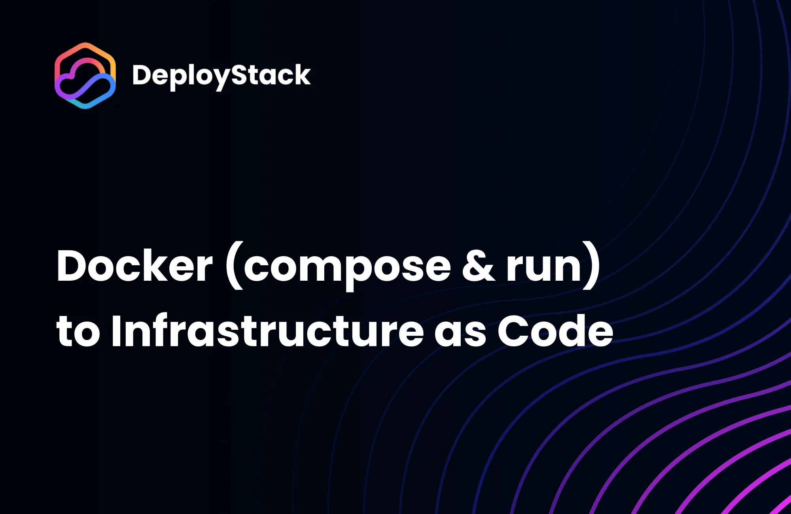

<p align="center">
  
</p>


A Node.js module that translates Docker configurations (Docker run commands and Docker Compose files) into cloud provider Infrastructure as Code templates.

## Installation

Install the module via npm:

```sh
npm i @deploystack/docker-to-iac
```

## Usage

### Translating Docker Compose

```typescript
import { translate } from '@deploystack/docker-to-iac';
import { readFileSync, writeFileSync } from 'fs';

// Read Docker Compose file
const dockerComposeContent = readFileSync('docker-compose.yml', 'utf8');

const translatedConfig = translate(dockerComposeContent, {
  source: 'compose',
  target: 'CFN',
});

writeFileSync('output-aws.yml', translatedConfig);
```

### Translating Docker Run Commands

```typescript
import { translate } from '@deploystack/docker-to-iac';
import { writeFileSync } from 'fs';

const dockerRunCommand = 'docker run -d -p 8080:80 nginx:latest';

const translatedConfig = translate(dockerRunCommand, {
  source: 'run',
  target: 'CFN',
});

writeFileSync('output-aws.yml', translatedConfig);
```

## Features

- Supports both Docker run commands and Docker Compose files
- Generates templates for multiple cloud providers [deploystack.io/docs/docker-to-iac/parser](https://deploystack.io/docs/docker-to-iac/parser)
- Multiple output formats (YAML, JSON, text)
- Preserves configuration options:
  - Port mappings
  - Environment variables
  - Volume mounts
  - Container commands
  - Restart policies

## Documentation

Full documentation available at [deploystack.io/docs/docker-to-iac](https://deploystack.io/docs/docker-to-iac), including:

- Complete API reference
- Supported Docker configurations
- Cloud provider specifics
- Usage examples
- Best practices

## Requirements

- Node.js 14 or higher
- Docker images must be publicly accessible
- Supports Docker Compose specification v3+
- Standard Docker run command syntax

## Contributing

Contributions welcome! Check our [contribution guidelines](https://deploystack.io/docs/docker-to-iac/before-you-start) for:

- Adding new cloud providers
- Extending functionality
- Improving documentation
- Reporting issues

## License

Apache License 2.0 - free to use, modify, and distribute.
